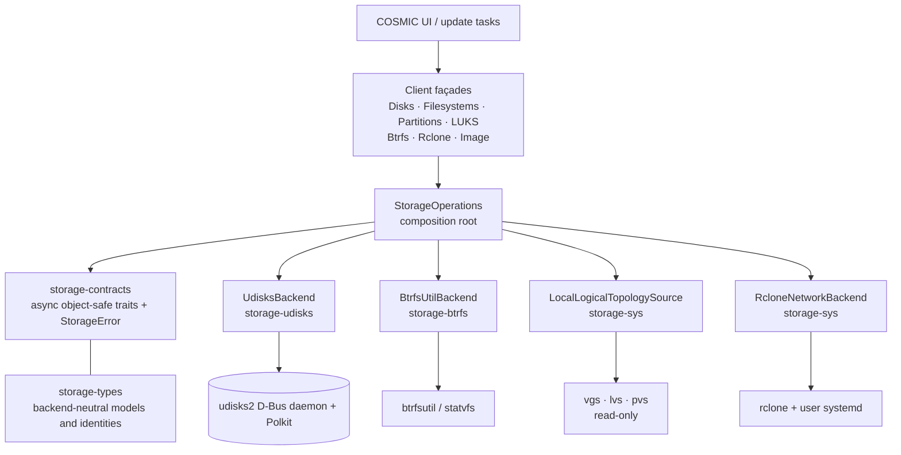
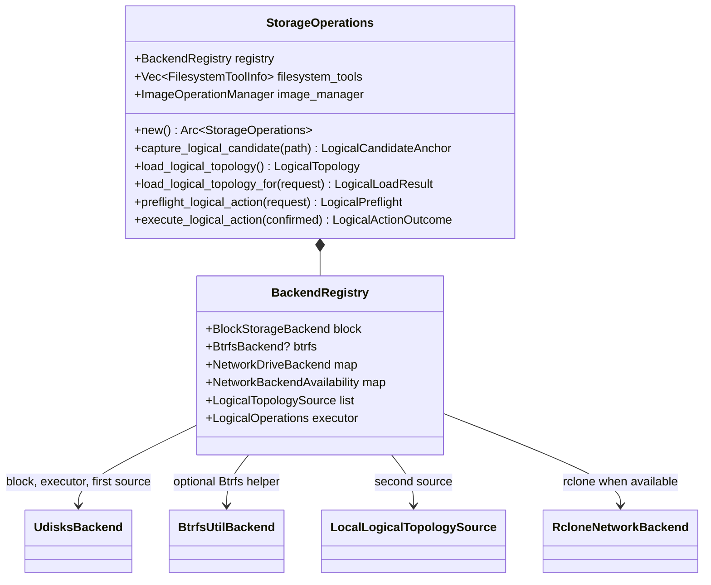

# Storage API architecture

COSMIC Storage exposes an in-process Rust API. It is not a project-owned D-Bus
or network service: the desktop application runs as the logged-in user and
delegates privileged local storage work to the system `udisks2` daemon and its
normal Polkit rules. The backend-neutral contract surface is the
`storage-contracts` crate.

Application code normally enters through `StorageOperations` and its client
façades. Adapters implement the contracts beneath it, keeping application code
independent from UDisks object paths, rclone configuration syntax, and local
command parsing.

## Layering and composition



The core composition root is
[`StorageOperations`](../../src/operations/mod.rs). It is created once per
process by `shared()` and keeps only trait objects in its registry:



`StorageOperations::new()` registers production adapters in this authority
order:

| Registry field | Registered value | Responsibility |
| --- | --- | --- |
| `block` | `UdisksBackend` | Local discovery, events, disks, partitions, filesystems, LUKS, and image-device access. |
| `logical_topology_sources[0]` | `UdisksBackend` | Authoritative LVM, MD RAID, and Btrfs discovery. |
| `logical_topology_sources[1]` | `LocalLogicalTopologySource` | Read-only local LVM display enrichment. |
| `logical_operations` | `UdisksBackend` | The only logical-storage mutation authority. |
| `btrfs` | `BtrfsUtilBackend` | Local Btrfs filesystem-usage reads. |
| `network["rclone"]` | `RcloneNetworkBackend` | Added only when rclone initializes; failures remain in `network_availability`. |

`DisksClient`, `FilesystemsClient`, `PartitionsClient`, `LuksClient`,
`BtrfsClient`, `RcloneClient`, and `ImageClient` are focused façades over the
same shared operations object. Prefer one for an existing application flow:
they add app-level policies such as filesystem-tool checks and busy-unmount
recovery. Use the registry directly for new backend-neutral work:

```rust
let operations = StorageOperations::new().await?;
let disks = operations.registry.block.list_disks().await?;
```

## Main contract interface

Traits live in
[`crates/storage-contracts/src/traits`](../../crates/storage-contracts/src/traits).
They use `async_trait`, are `Send + Sync`, and are object-safe, enabling
`Arc<dyn Trait>` registrations. All asynchronous calls return
`Result<T, StorageError>`; backend-private errors must not leak above the
contract boundary.

### Aggregate contracts

| Trait | Detail |
| --- | --- |
| `BackendMetadata` | `id() -> BackendId` and `capabilities() -> StorageBackendCapabilities`. The capability fields are drive power management, partitioning, filesystem, encryption, image, and logical storage. Use them for feature visibility, but still handle `Unsupported` on an individual operation. |
| `BlockStorageBackend` | A blanket aggregate of `BackendMetadata`, `DiskDiscovery`, `DeviceEventSource`, `DriveOperations`, `PartitionOperations`, `FilesystemOperations`, `EncryptionOperations`, and `ImageDeviceOperations`. Implement every constituent trait and the blanket implementation applies automatically. |
| `BtrfsBackend` | A blanket aggregate of `BackendMetadata` and `BtrfsOperations`. |

### Block-storage contracts

| Contract | Complete method set | Result semantics |
| --- | --- | --- |
| `DiskDiscovery` | `list_disks`, `list_volumes` | Returns `Vec<DiskInfo>` or `Vec<VolumeInfo>`. Volumes are flat; `parent_path` preserves tree relationships. |
| `DeviceEventSource` | `device_events` | Returns a pinned stream of `Result<DeviceEvent, StorageError>`, where the event is `Added(path)` or `Removed(path)`. |
| `DriveOperations` | `smart_info`, `start_smart_selftest`, `eject`, `power_off`, `standby`, `wakeup`, `safe_remove` | Whole-drive control. Eject, power-off, and remove accept discovered device-capability facts. |
| `PartitionOperations` | `list_partitions`, `create_partition_table`, `create_partition`, `create_partition_with_filesystem`, `delete_partition`, `resize_partition`, `set_partition_type`, `set_partition_flags`, `set_partition_name` | Offsets and sizes are byte `u64`s. Create operations return the new device/path. |
| `FilesystemOperations` | `list_filesystems`, `format_filesystem`, `mount_filesystem`, `get_mount_point`, `unmount_filesystem`, `blocking_processes`, `kill_processes`, `check_filesystem`, label getters/setters, mount-setting getters/setters/reset, `take_filesystem_ownership` | Mount returns the effective mount path; check returns a cleanliness boolean. Mount settings are explicit fields, not an untyped map. |
| `EncryptionOperations` | `list_luks_devices`, `format_luks`, `unlock_luks`, `lock_luks`, `change_luks_passphrase`, encryption-setting getters/setters/clear | Unlock returns the activated mapping/device path. |
| `ImageDeviceOperations` | `open_for_backup`, `open_for_restore`, `loop_setup` | Backup/restore return `OwnedFd`, preserving owned device access for image tasks; loop setup returns a device path. |

`FilesystemsClient::unmount` adds policy around the contract: it first tries the
native unmount; on busy/in-use failure it lists blockers, optionally refuses to
kill them on protected system paths, and retries after permitted termination.

### Btrfs, logical, and network contracts

| Contract | Complete method set | Detail |
| --- | --- | --- |
| `BtrfsOperations` | `list_subvolumes`, `create_subvolume`, `create_snapshot`, `delete_subvolume`, `set_readonly`, `set_default`, `default_subvolume`, `deleted_subvolumes`, `filesystem_usage` | The supplied mount point scopes each operation. The trait supports Btrfs tooling; the native logical UI uses `LogicalOperations` for mutations. |
| `LogicalTopologySource` | `logical_source`, `logical_availability`, `list_logical_entities` | Discovery-only source. It publishes identity and availability separately from a load result. |
| `LogicalOperations` | `capture_logical_candidate`, `preflight_logical_action`, `execute_logical_action` | Captures a physical-sidebar item as a typed navigation anchor, reviews current native eligibility, then executes a closed, typed and preflight-bound native mutation. No command fragments, D-Bus paths, or free-form native option maps are accepted. |
| `NetworkDriveBackend` | `id`, `capabilities`, `configuration_schema`, config `list/create/update/delete`, `test_config`, `mount`, `unmount`, `mount_status`, and mount-on-login `get/set` | The adapter owns provider syntax and persistence. UI code renders generic schemas and routes stable backend/config IDs. |

### Protocol and error vocabulary

| Type | Purpose |
| --- | --- |
| `StorageError { kind, message }` | The only cross-contract error. Kinds: `InvalidInput`, `NotFound`, `PermissionDenied`, `Conflict`, `Unsupported`, `Busy`, `Timeout`, `Unavailable`, `Other`, and `Internal`. |
| `OperationId`, `OperationProgress`, `OperationEvent` | Generic UUID-backed progress/completed/failed reporting, with operation kinds for discovery, partitioning, filesystem, encryption, image, LVM, Btrfs, rclone, and usage scans. |
| `OperationError` | Application conversion of `StorageError`; `Busy`, `Conflict`, `Unsupported`, and `PermissionDenied` stay distinguishable while unknown/internal failures become generic app failures. |

The generic event vocabulary does not imply universal progress support. Current
native logical actions return an outcome after their UDisks call with
`native_job_id: None` and `progress: None`.

## Production trait implementations

| Concrete type | Crate | Explicit trait implementations | Runtime role |
| --- | --- | --- | --- |
| `UdisksBackend` | `storage-udisks` | `BackendMetadata`, `DiskDiscovery`, `DeviceEventSource`, `DriveOperations`, `PartitionOperations`, `FilesystemOperations`, `EncryptionOperations`, `ImageDeviceOperations`, `LogicalTopologySource`, `LogicalOperations` | Shipped local block adapter and sole logical mutator; gains `BlockStorageBackend` through its blanket impl. |
| `BtrfsUtilBackend` | `storage-btrfs` | `BackendMetadata`, `BtrfsOperations` | Direct btrfsutil helper; gains `BtrfsBackend` through its blanket impl. |
| `LocalLogicalTopologySource` | `storage-sys` | `LogicalTopologySource` | Safe, read-only local LVM display source. |
| `RcloneNetworkBackend` | `storage-sys` | `NetworkDriveBackend` | Per-user rclone configurations, mounting, connection tests, and mount-on-login. |

Test-only `ReadOnlySource` and `Executor` types in `storage-contracts` tests
illustrate trait-object separation; they are not runtime adapters.

### `UdisksBackend`

Sources: [`backend.rs`](../../crates/storage-udisks/src/backend.rs) and
[`logical/`](../../crates/storage-udisks/src/logical).

`UdisksBackend::new()` creates one `DiskManager` over the system D-Bus. Its
clones share that manager and an atomic object-manager generation named
`logical_epoch`. `enable_optional_modules()` asks the daemon to load optional
modules (notably Btrfs); its failure is non-fatal for ordinary disk operations.
It identifies as `udisks2` and advertises every broad block-storage capability.

| Implemented area | Behaviour | Important detail |
| --- | --- | --- |
| Discovery | Delegates disk discovery to UDisks. For volume discovery, walks each UDisks volume tree, flattens it, and records the parent device path. | Models remain `storage-types` values. |
| Events | Maps UDisks added/removed signals to the shared `DeviceEvent` stream. | Every event increments `logical_epoch`, invalidating stale logical device selections. |
| Drives | Delegates SMART queries/self-tests and eject/power/standby/wakeup/safe-remove helpers. | UDisks performs native authorization. |
| Partitions | Resolves a device to a UDisks block object path for table/create calls, obtains lists from discovered disk trees, and delegates mutations. | A missing disk becomes `StorageErrorKind::NotFound`. |
| Filesystems | Derives `FilesystemInfo` by walking volumes and delegates format/mount/unmount/check/label/configuration/ownership work. Mount calls include the current effective UID. | Process lookup is local; failed process termination is `PermissionDenied`. |
| Encryption | Delegates all LUKS operation and persisted-setting calls. | Uses UDisks encryption interfaces and configuration. |
| Image devices | Opens devices for backup/restore and creates loop devices. | Image copying/progress lives in the app's `ImageOperationManager`. |
| Logical discovery | Reads the UDisks object manager and plugin interfaces for LVM, MD RAID, Btrfs filesystems, and subvolumes. | Supplies entity IDs, capabilities, typed entity details, stable device references, and source `Udisks`. |
| Logical execution | Captures anchors, creates epoch-bound preflights, freshly resolves entities/devices, and calls exactly one native UDisks method for a confirmed action. | It is the only registered `LogicalOperations` executor. |

UDisks native errors are normalized: authorization-like failures become
`PermissionDenied`, busy/in-use becomes `Busy`, missing objects `NotFound`,
unsupported methods `Unsupported`, invalid input `InvalidInput`, unavailable
services `Unavailable`, and remaining native failures `Other`.

#### Typed logical navigation and action dispatch

Physical sidebar paths are display-only inputs. Selecting one calls
`capture_logical_candidate`, which records a `LogicalCandidateAnchor` containing
the block major/minor, the observed UDisks epoch, and (when available) a strong
fingerprint. `load_logical_topology_for` loads current topology and resolves
that anchor through typed member references. The original path is retained only
to explain an unavailable selection; it is never used to select a root or
authorize an operation after capture.

The UI next sends a `LogicalPreflightRequest` for a complete typed action (or
for a typed device-picker operation). UDisks returns an epoch-bound
`LogicalPreflight` containing availability, input constraints, review data, and
current device candidates. Only a ready preflight can be wrapped with its key
in `ConfirmedLogicalAction` and passed to the executor. The executor re-checks
the target and all references immediately before its single native call; an
expired preflight, stale selection, or changed candidate is rejected.

The executor never trusts a caller-supplied D-Bus path. It resolves the typed
logical ID at submission time and maps action families as follows:

| Family | `LogicalAction` variants | Native UDisks target |
| --- | --- | --- |
| LVM volume group | `CreateLvmVolumeGroup`, `DeleteLvmVolumeGroup`, `AddLvmPhysicalVolume`, `RemoveLvmPhysicalVolume` | LVM2 manager `VolumeGroupCreate`, then `VolumeGroup` methods. |
| LVM logical volume | `CreateLvmLogicalVolume`, `DeleteLvmLogicalVolume`, `ResizeLvmLogicalVolume`, `ActivateLvmLogicalVolume`, `DeactivateLvmLogicalVolume` | `VolumeGroup.CreatePlainVolume` and `LogicalVolume` methods. |
| MD RAID | `CreateMdRaidArray`, `DeleteMdRaidArray`, `StartMdRaidArray`, `StopMdRaidArray`, `AddMdRaidMember`, `RemoveMdRaidMember`, `RequestMdRaidSync` | UDisks manager `MDRaidCreate` and `MDRaid` methods; sync is only typed `Check` or `Repair`. |
| Btrfs | `AddBtrfsDevice`, `RemoveBtrfsDevice`, `ResizeBtrfsFilesystem`, `SetBtrfsLabel`, `SetBtrfsDefaultSubvolume`, `CreateBtrfsSubvolume`, `DeleteBtrfsSubvolume`, `CreateBtrfsSnapshot` | `org.freedesktop.UDisks2.Filesystem.BTRFS` methods. |

Before any resolution, `LogicalAction::validate()` enforces target prefixes
(`lvm-vg:`, `lvm-lv:`, `mdraid:`, `btrfs:`), safe names and Btrfs relative
paths, parseable typed block identities, distinct members and audited MD RAID
member counts, and canonical destructive confirmation scopes. The current
policy variants deliberately preserve LVM labels, MD signatures, and
fstab/crypttab-style configuration. A destructive scope must be sorted and
must exclude the primary target; the adapter compares it with current native
collateral scope before deletion.

A selected `BlockDeviceRef` contains the mapper or block node's major/minor ID,
a strong fingerprint, and the object-manager generation observed at discovery.
Fingerprints are derived from a drive WWN plus serial; for NVMe, UDisks exposes
the WWN on the namespace rather than the drive, so the namespace WWN is paired
with the drive serial. A partition UUID is bound to that drive identity when
available, and loop devices use their backing-file identity. A cleartext
`/dev/mapper/*` device has no direct drive, so the UDisks adapter follows
`Block.CryptoBackingDevice` and derives the fingerprint from the LUKS backing
partition/drive. This lets an encrypted-root Btrfs mapping survive a
Polkit-triggered topology refresh without treating its filesystem UUID or
display path as authority. Bare `Block.IdUUID`, filesystem UUIDs, and unbound
partition UUIDs never authorize a logical mutation.

The adapter resolves every reference twice and rejects a stale, missing,
changed, or ambiguous device before sending a native mutation. Only
`BtrfsResizeRequest::AbsoluteBytes` currently has an audited UDisks dispatch;
`Maximum`, `GrowBy`, and `ShrinkBy` return `Unsupported` at dispatch.

### `BtrfsUtilBackend`

Source: [`crates/storage-btrfs/src/backend.rs`](../../crates/storage-btrfs/src/backend.rs).

This zero-sized adapter identifies as `btrfsutil` and reports default (all
false) broad block capabilities. It creates a `SubvolumeManager` for the given
mount point per call and maps btrfsutil failures to `StorageErrorKind::Internal`.

| `BtrfsOperations` area | Implementation |
| --- | --- |
| Listing/default/deleted values | `list_subvolumes` combines `list_all` and `get_default`; `default_subvolume` reads the default ID; `deleted_subvolumes` converts btrfsutil values to shared types. |
| Subvolume mutation | Create, snapshot, delete, readonly, and default operations directly delegate to `SubvolumeManager`. |
| Usage | `filesystem_usage` is a direct local filesystem-usage query. |

The registered `BtrfsClient` uses this adapter only for
`BtrfsClient::get_usage`; its native subvolume list is read from logical
topology. It exposes no Btrfs mutation API. The logical UI resolves a UDisks
Btrfs entity and submits a typed logical action, so mutations do **not** fall
back to btrfsutil and UDisks retains normal Polkit authorization. Recursive
delete is explicitly unsupported because it has no audited UDisks mapping.

### `LocalLogicalTopologySource`

Source: [`crates/storage-sys/src/logical/mod.rs`](../../crates/storage-sys/src/logical/mod.rs).

This is intentionally discovery-only; it does not implement `LogicalOperations`.
Its fixed, read-only command allow-list is `vgs`, `lvs`, and `pvs` with known
tab-separated output arguments. It is available only if all three programs are
available. Otherwise it reports `LogicalSourceAvailability::Unavailable` and
an explanatory reason.

When available, it parses volume groups, logical volumes, and physical volumes
into shared entities. Every returned entity is marked with
`LogicalCapabilities::block_all("Not discovered by UDisks")`, preventing a
local-tool discovery record from gaining mutation authority. Malformed records,
invocation failures, and forbidden command attempts map to
`StorageErrorKind::Other`. The `LogicalCommandRunner` abstraction makes this
source testable without spawning commands.

### `RcloneNetworkBackend`

Source: [`crates/storage-sys/src/rclone/backend.rs`](../../crates/storage-sys/src/rclone/backend.rs).

This adapter requires the user `HOME` and an available rclone CLI. It is
strictly user-scoped and never reads `/etc/rclone.conf` or manages a system
unit.

| Concern | Implementation |
| --- | --- |
| Persistence | Reads/writes `$HOME/.config/rclone/rclone.conf`; a missing file is an empty configuration. |
| Generic configs | A remote name is both `NetworkDriveConfig.id` and `.name`; it must use alphanumerics, `-`, or `_`, and must belong to backend ID `rclone`. |
| UI schema | Builds generic provider/field schemas from the rclone catalog, including help, examples, choices, defaults, required/secret/advanced/visible flags, and input kind. |
| Secret handling | `has_secrets` says whether a configured secure field is non-empty; separate secret values are not exposed by the model. |
| Mounting | Mounts at `$HOME/mnt/<remote>`; status reads that mount point. Login mounting is managed through matching user systemd configuration. |
| Errors | Missing rclone/config -> `Unavailable`; absent remote -> `NotFound`; permission failure -> `PermissionDenied`; already/not mounted -> `Conflict`; parse error -> `InvalidInput`; remaining system errors -> `Internal`. |

`NetworkDriveCapabilities::default()` currently supports connection testing and
mount-on-login. `RcloneClient` is a compatibility façade for the current view:
it converts generic configs to legacy rclone models and rejects every scope
other than `user`.

## Logical topology and mutation flow

Logical discovery and mutation are intentionally separate: several sources may
provide a read-only picture, but exactly one executor may mutate native state.

```mermaid
sequenceDiagram
    participant UI as Logical UI
    participant Ops as StorageOperations
    participant U as UdisksBackend
    participant L as LocalLogicalTopologySource
    participant D as udisks2 + Polkit

    UI->>Ops: capture_logical_candidate(display path)
    Ops->>U: capture current typed anchor
    U-->>Ops: LogicalCandidateAnchor
    UI->>Ops: load_logical_topology_for(anchor)
    Ops->>U: list_logical_entities()
    U->>D: object manager + plugin queries
    D-->>U: entities, IDs, capabilities, generation
    Ops->>L: list_logical_entities()
    L-->>Ops: read-only LVM entities / availability reason
    Ops->>Ops: merge by LogicalEntityId; UDisks wins
    Ops-->>UI: LogicalLoadResult + source statuses

    UI->>Ops: preflight_logical_action(typed action/request key)
    Ops->>U: sole LogicalOperations executor
    U->>U: review current target, epoch, and candidate refs
    U-->>Ops: LogicalPreflight
    UI->>Ops: execute_logical_action(confirmed action + preflight key)
    Ops->>U: sole LogicalOperations executor
    U->>U: validate; freshly resolve target/device refs
    U->>D: native UDisks method; Polkit as required
    D-->>U: result
    U-->>Ops: LogicalActionOutcome / StorageError
    Ops-->>UI: result; reload topology on success
```

`load_logical_topology()` requires the source order `[Udisks, LocalTools]`.
It loads both sources even if the first fails and includes a status for each.
On an ID collision, the UDisks entity owns the record; local discovery only
fills absent display fields (UUID, path, usage, health, progress, metadata, and
new members). Local-only entities have all operations blocked. If UDisks
reports a source failure, its discovered entities are also blocked to avoid
actions against incomplete native state.

Callers should retain typed anchors, IDs, device refs, capability flags, and
preflight confirmation data from fresh topology rather than recreating them
from display strings:

```rust
use storage_contracts::{
    ConfirmedLogicalAction, LogicalAction, LogicalPreflightAvailability,
    LogicalPreflightRequest, LogicalPreflightRequestKey, LogicalPreflightTarget,
};
use storage_types::LogicalOperation;

let loaded = operations.load_logical_topology_for(Default::default()).await?;
let filesystem = loaded.topology.entities.iter()
    .find(|entity| entity.capabilities.is_allowed(LogicalOperation::SetLabel))
    .ok_or_else(|| anyhow::anyhow!("No writable Btrfs filesystem"))?;

let action = LogicalAction::SetBtrfsLabel {
    filesystem: filesystem.id.clone(),
    label: "Archive".into(),
};
let preflight = operations.preflight_logical_action(LogicalPreflightRequest {
    request_key: LogicalPreflightRequestKey {
        target: LogicalPreflightTarget::Root(filesystem.id.clone()),
        action_kind: action.kind(),
        logical_load_generation: 4,
        draft_revision: 1,
    },
}).await?;
if !matches!(preflight.availability, LogicalPreflightAvailability::Ready) {
    anyhow::bail!("The current logical action is unavailable");
}
operations.execute_logical_action(ConfirmedLogicalAction {
    action,
    preflight_key: preflight.key,
}).await?;
```

Production UI code must additionally require a ready preflight before it makes
the `ConfirmedLogicalAction`. For destructive operations, construct the exact
`ConfirmedDestructiveScope` from the latest topology, render the confirmation,
and submit that same action. Never replace it with a device path or stale UI
state.

## Normal operation flow and extension points

The façade policy is deliberately small and explicit:

| Façade | Additional behaviour |
| --- | --- |
| `DisksClient` | Accepts user-friendly disk aliases; converts SMART information to existing UI values; only accepts `short` or `extended` tests. |
| `PartitionsClient` | Normalizes table input to UDisks `gpt` or `dos` and rejects other values. |
| `FilesystemsClient` | Requires both a compile-time filesystem feature and an installed `mkfs.*` tool before formatting; owns usage scans and guarded regular-file deletion. |
| `LuksClient` | Exposes compact unlock/lock/passphrase and persistent-settings calls. |
| `BtrfsClient` | Reads native Btrfs topology and uses btrfsutil only for usage; the logical page owns typed native Btrfs mutations. |
| `RcloneClient` | Provides the existing rclone view models while relying only on `NetworkDriveBackend`. |
| `ImageClient` | Coordinates copying, progress, cancel/wait, and cleanup after the block adapter supplies owned device file descriptors. |

Subscribe to the block event stream for hot-plug refreshes. The event is also a
safety boundary because it increments UDisks's logical generation:

```rust
use futures_util::StreamExt;

let mut events = operations.registry.block.device_events().await?;
while let Some(event) = events.next().await {
    match event? {
        storage_types::DeviceEvent::Added(path) => refresh_after_add(path).await,
        storage_types::DeviceEvent::Removed(path) => refresh_after_remove(path).await,
    }
}
```

To add an adapter, depend on `storage-contracts` and `storage-types`, implement
only the narrowest meaningful trait, then register an `Arc<dyn ...>` in the
composition root. A full block replacement must implement every constituent of
`BlockStorageBackend`; a supplementary logical source should implement only
`LogicalTopologySource`; a network provider should use a unique
`NetworkBackendId` and return generic schemas. Client constructors such as
`DisksClient::with_operations` provide the preferred test seam: inject a
registry built from mock contracts without real disks, UDisks, or rclone.

## Runtime requirements and safety limits

- `udisks2` is required for local discovery, events, ordinary storage work,
  and all logical mutations. LVM2, MD RAID, and Btrfs UDisks modules determine
  logical feature availability at runtime.
- No project service, socket, D-Bus policy, or Polkit policy is installed.
  Privileged operations use UDisks's native Polkit prompts.
- Formatting additionally requires its feature to be built and the matching
  `mkfs.*` executable to be present on `PATH`.
- rclone is optional and per-user; its unavailability does not disable local
  storage and is reported through `network_availability`.
- Typed identity, capability checks, freshness validation, and confirmation
  scopes reduce ambiguity but do not make a destructive action safe by
  themselves. UI code must still provide clear confirmation and handle errors.

## Source map

| Concern | Source |
| --- | --- |
| Composition root / registry | [`src/operations/mod.rs`](../../src/operations/mod.rs) |
| Logical merge and execution façade | [`src/operations/logical.rs`](../../src/operations/logical.rs) |
| Contract exports | [`crates/storage-contracts/src/lib.rs`](../../crates/storage-contracts/src/lib.rs) |
| Trait definitions and action validation | [`crates/storage-contracts/src/traits`](../../crates/storage-contracts/src/traits) |
| UDisks adapter | [`crates/storage-udisks/src/backend.rs`](../../crates/storage-udisks/src/backend.rs), [`logical`](../../crates/storage-udisks/src/logical) |
| btrfsutil adapter | [`crates/storage-btrfs/src/backend.rs`](../../crates/storage-btrfs/src/backend.rs) |
| Local LVM source | [`crates/storage-sys/src/logical/mod.rs`](../../crates/storage-sys/src/logical/mod.rs) |
| rclone adapter | [`crates/storage-sys/src/rclone/backend.rs`](../../crates/storage-sys/src/rclone/backend.rs) |
| Shared models | [`crates/storage-types/src`](../../crates/storage-types/src) |
