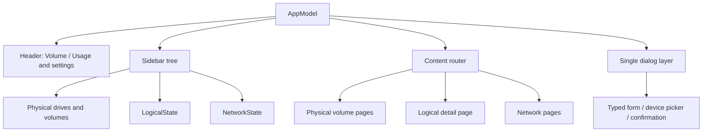
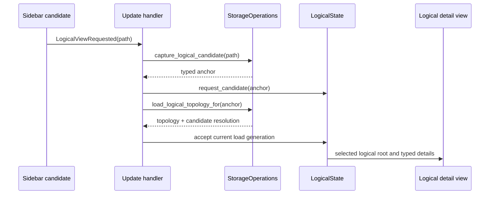

# UI architecture

COSMIC Storage is a single native COSMIC application. Its view is a function
of [`AppModel`](../../src/state/app.rs), and every user event is a typed
[`Message`](../../src/message/app.rs) handled in
[`src/update/mod.rs`](../../src/update/mod.rs). Storage discovery and native
operations stay behind the application operations façade; views never invoke
UDisks or build native object paths themselves.

## Application structure

The persistent shell consists of the header, the custom sidebar tree, the main
content area, and at most one modal dialog. The normal physical-volume page
remains the default content. Network editing takes precedence when it is
active; a requested logical view then takes precedence over the physical page.
This routing is implemented by [`views/app.rs`](../../src/views/app.rs).

The sidebar has Logical, Internal, External, and Images sections. It derives
logical candidates from the current physical-volume tree (Btrfs, LVM physical
volumes, and MD RAID members), then renders loaded logical entities beneath
their resolved candidate. It is deliberately a filesystem picker: one row per
resolved logical filesystem, with no member, volume, or subvolume descendants.
An unresolved physical candidate remains a single row so it can be opened and
captured safely. Logical entity selection is an ID, not a path. The path in an
unopened candidate is only the input used to capture a fresh navigation anchor.

## Logical storage state and navigation

[`LogicalState`](../../src/state/logical.rs) owns the logical screen's data and
transient workflow state:

- `selected_candidate` is the stable, epoch-bound anchor captured from a
  physical sidebar row; `selected_device` is retained for display/routing
  compatibility only.
- `entities`, `source_statuses`, `selected`, and `candidate_resolution` describe
  the latest logical topology and selected root.
- `draft`, `preflight`, `confirmation`, and `pending` represent successive
  states of one logical operation.
- Monotonically increasing load and action generations cause late asynchronous
  results to be ignored instead of overwriting newer state.

If a candidate resolves, its root entity becomes selected and replaces that
candidate in the sidebar's filesystem list. If the UDisks source is unavailable,
the selected device has no strong identity, or the member has disappeared, the content page
shows an unavailable/missing state with a retry action. It does not fall back
to matching a filesystem UUID or the old display path.

Cleartext encrypted mappings are supported by the native identity layer: a
`/dev/mapper/*` Btrfs item is anchored to its mapper major/minor plus a stable
fingerprint derived from UDisks's `CryptoBackingDevice`. Consequently, a
Polkit prompt and the topology refresh after it do not strand a normal
encrypted-root Btrfs filesystem in the unavailable page.

## Logical detail page

[`views/logical.rs`](../../src/views/logical.rs) is a structured detail page,
not a second tab system. Btrfs follows the approved mock's compact identity and
green mount-usage ring, with icon-only refresh, label, add-device, and resize
controls (tooltips provide accessible labels and accent colors identify
constructive controls; success and destructive actions use their themed green
and red). Its mount usage is a read-only
`statvfs` snapshot of the first UDisks-reported mount point; it is explicitly
not a filesystem-wide Btrfs allocation value. Clean, divided Devices and
Subvolumes sections use themed state LEDs and icon-only row actions rather than
a generic metadata list. The subvolume section is an expandable hierarchy: a
unique, validated native parent ID becomes the child entity's `parent_id`; an
unreported or ambiguous parent leaves the row directly under the filesystem.
Subvolume rows are structural and action-only; selection never replaces this
page with a generic subvolume detail screen. They retain their native subvolume
ID beneath the label. Snapshot, delete, and make-default actions remain
available on parent rows whenever the native ID, path, and parent identity form
an unambiguous target; hierarchy only controls presentation. The reported
default ID is resolved to a visible subvolume path and ID (or `/ (ID 5)` for
the filesystem root). The shared Usage tab continues to render its scanner UI
while logical storage is open. Logical forms and pickers use COSMIC modal
dialogs, not the full-page wizard shell.
Other roots use the same
detail-page shell and choose
sections from their `LogicalEntityDetails` variant:

| Root kind | Sections | Examples of controls |
| --- | --- | --- |
| Btrfs filesystem | Identity/usage header, devices, subvolume hierarchy | Add/remove device, resize, label, set default subvolume, create/delete subvolume, create snapshot |
| LVM volume group | Summary, physical-volume members, manage | Add/remove physical volume, create logical volume, delete volume group |
| LVM logical volume | Summary, manage | Resize, activate/deactivate, delete |
| MD RAID array | Summary, members, manage | Add/remove member, start/stop, check/repair, delete |

Rows and buttons are driven by the capabilities and typed references in the
current entity. Unknown display values remain visibly unknown; generic metadata
strings are not parsed to decide what the UI may render or execute. The older
physical Btrfs page contains only an **Open Logical Storage** handoff
([`views/btrfs.rs`](../../src/views/btrfs.rs)); it no longer owns subvolume or
device mutation controls.

## Mutation workflow

The UI separates editing, current native review, human confirmation, and
execution. This prevents a dialog from turning a remembered path or a stale row
into an operation target.

```mermaid
stateDiagram-v2
    [*] --> Detail
    Detail --> Form: operation needs text/size/subvolume input
    Detail --> Preflight: immediate operation
    Form --> Preflight: valid typed action
    Preflight --> Execute: create subvolume or snapshot, ready
    Detail --> DevicePickerPreflight: add member/device
    DevicePickerPreflight --> DevicePicker: current candidates returned
    DevicePicker --> Preflight: choose ready BlockDeviceRef
    Preflight --> Confirmation: ready, matching request key
    Preflight --> Detail: blocked or stale
    Confirmation --> Execute: user confirms
    Confirmation --> Detail: cancel
    Execute --> Detail: success; reload logical + physical drives
    Execute --> Form: failure for editable action
```

1. A direct control either produces a complete `LogicalAction` or opens a
   typed form. Forms edit only semantic values such as a name, label, byte
   size, relative subvolume name, or snapshot destination. Device and
   subvolume identities stay typed and non-editable.
2. For actions that choose a device, the UI first asks for an operation-specific
   preflight. The picker displays the backend's current ready and blocked
   candidates, with a reason for every blocked row. It never accepts a path
   typed by the user.
3. The update handler asks the backend to preflight the complete draft. It
   accepts a response only when its request key matches the current logical
   load generation and form revision.
4. A ready preflight creates `ConfirmedLogicalAction`. Creating a Btrfs
   subvolume or snapshot is single-step: its dialog submits directly to
   execution after this preflight. Other actions use a confirmation dialog that
   holds that exact value. Destructive actions include their reviewed collateral
   scope.
5. On confirmation the backend performs the native UDisks call, including any
   Polkit interaction. While pending, duplicate logical operations are blocked.
   On success the app reloads both logical topology and physical drives; on an
   editable failure it restores the form with the reported error.

The dialog layer is centralized in [`views/app.rs`](../../src/views/app.rs).
Logical dialogs live in
[`views/dialogs/logical.rs`](../../src/views/dialogs/logical.rs) and have
exactly three roles: semantic-value form, backend-fed device picker, and final
confirmation.

## Sources and test seams

The UI consumes the merged application-level topology, not adapter-specific
models. UDisks is the only mutation authority; the local LVM source can enrich
display-only information but cannot enable a control by itself. The same
separation makes the state transitions testable without a running native
desktop: logical-state tests exercise generation, preflight, and confirmation
acceptance, while adapter contract tests cover native identity and validation.

For the associated storage contract and native identity rules, see
[API architecture](api.md).
