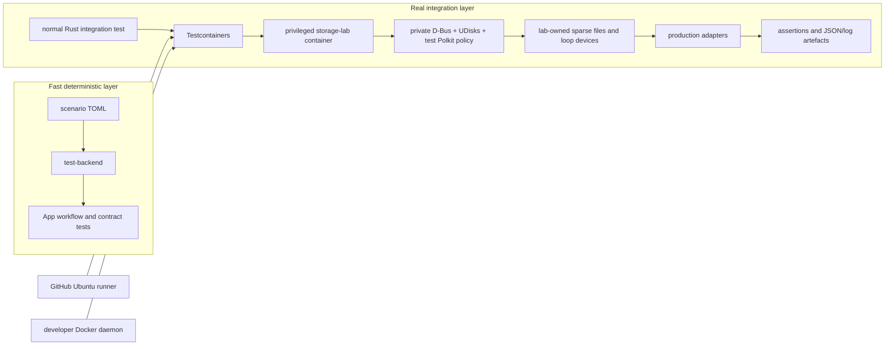

# Testing V2 specification: executable storage integration lab

**Status:** proposed design; no implementation in this document.

## 1. Purpose

Testing V2 replaces the current non-executing real-storage harness with a
single Testcontainers-based storage integration lab. The same Rust tests and
the same pinned container image must run on a developer machine and in GitHub
Actions.

The lab tests the production storage adapters against disposable, loop-backed
devices. It complements the deterministic `test-backend` and does not turn the
scenario backend into an emulator of UDisks, the kernel, or Polkit.

This plan deliberately does **not** introduce nested virtual machines,
self-hosted runners, or cloud VM infrastructure.

## 2. Baseline and problem statement

The repository currently has three different testing claims:

| Layer | Current implementation | Confidence it provides |
| --- | --- | --- |
| Unit, contract, and workflow tests | Normal Rust tests plus `test-backend` | Strong for pure values, contract wiring, reducer ordering, virtual time, and declared fake-state behaviour. |
| UI E2E | A headless-Sway capability probe using `empty.toml` | Proves the container, compositor, application startup, AT-SPI tree, keyboard probe, and screenshot capture can work. It does not execute the eight declared UI cases. |
| `tools/storage-testing` | Case catalog, report/ledger, `NondestructiveExecutor`, and placeholder `FullLabExecutor` | Does **not** prove a storage operation. The nondestructive executor unconditionally returns `Passed`; the full-lab executor unconditionally returns `Blocked` because no typed executor exists. |

The last item is unsafe as a CI signal: `just harness-nondestructive` can pass
without invoking the product or a storage tool. It must not remain a required
real-adapter check.

The root application package currently has a measured baseline of **10.63%
line coverage**, **9.33% region coverage**, and **11.94% function coverage**.
The workflow test harness has high coverage while most view, update, and state
paths remain unexecuted. There is no coverage command, artefact, or threshold
in CI.

## 3. Goals

1. Use one Testcontainers lab for local development and GitHub Actions.
2. Exercise production `storage-udisks`, `storage-sys`, and application
   operation paths against real disposable storage state.
3. Make every required lab test execute an assertion-bearing Rust test. A
   required lab run may pass only when all selected tests have run and passed.
4. Confine destructive actions to loop devices backed by lab-owned sparse
   image files.
5. Preserve `test-backend` as the deterministic, host-safe test double for
   application workflows and UI scenarios.
6. Raise coverage of first-party executable code to a near-100% enforced
   standard in this pass.
7. Make the test manifest distinguish a runnable UI capability probe from
   implemented UI workflow cases.

## 4. Non-goals

- Nested QEMU/KVM, self-hosted runners, or a separate VM provisioning system.
- Testing a developer's or CI host's physical disks.
- Replacing `cargo test`/`cargo nextest` with a custom test runner.
- Making Docker a production dependency.
- Replacing the existing scenario backend, scenario schema, or its workflow
  tests.
- Claiming pixel-golden or interactive UI-case coverage before those cases
  exist and are executed.

## 5. Required architecture



### 5.1 One execution contract

`testcontainers` is the sole mechanism that starts, waits for, stops, and
collects evidence from the storage lab. Local and CI invocation differ only in
the Docker daemon selected by Testcontainers.

The storage cases themselves are ordinary named Rust integration tests. The
container test entry point must run those tests and return their native exit
status. There must be no parallel `CaseDefinition` registry, shell-dispatched
case list, or `Passed`/`Blocked` reporting protocol that can diverge from the
Rust test inventory.

The outer Testcontainers fixture is permitted to execute a pre-built,
container-internal test binary and copy its output directory. It may not
interpret a success report produced by a placeholder executor. A non-zero
inner test exit status fails the outer test and therefore CI.

### 5.2 New files and packages

Implementation creates these test-only assets:

```text
tools/storage-lab/
  Containerfile                 # pinned lab image definition
  entrypoint.sh                 # starts only private lab services
  polkit/                       # permissive policy scoped to lab identities
  fixtures/                     # checked-in sparse-image layout templates

crates/storage-lab-tests/
  Cargo.toml                    # publish = false
  src/lib.rs                    # Lab fixture, safety checks, artefact helpers
  tests/
    disk.rs
    partition.rs
    filesystem.rs
    encryption.rs
    image.rs
    logical.rs
    btrfs.rs
    network.rs

tests/storage_lab.rs            # Testcontainers lifecycle/inner-test bridge
.config/nextest.toml            # serial storage-lab test group and timeouts
```

The exact public package name is `storage-lab-tests`; its library crate name
is `storage_lab_tests`. It is a workspace member but is never published and is
not a normal dependency of the application or of `test-backend`.

`tools/storage-testing/` is deleted only after all required cases in section 8
are represented by runnable `storage-lab-tests` integration tests and the new
CI job is required. Its workspace member, Just recipes, CI invocation,
documentation references, and harness-specific test files are deleted in the
same change. Do not retain its catalog as a second source of truth.

### 5.3 Container image

`tools/storage-lab/Containerfile` must pin its base image by digest and pin
the package source/snapshot used for packages. It installs only the components
required to exercise the production path:

- UDisks2, D-Bus, Polkit and udev support required by UDisks;
- LVM2, mdadm, cryptsetup, Btrfs tools, filesystem tools, and `losetup`;
- the rootless/non-network test helper dependencies; and
- the built `storage-lab-tests` test binary and production adapter libraries.

The entry point starts a private system bus and only the lab's UDisks/Polkit
services. It must not connect to or mount the host system bus, host runtime
directory, host home directory, or a developer's configuration. Its readiness
endpoint proves that the private D-Bus service and UDisks object manager are
available before a test begins.

The container has no external network after image build. Testcontainers must
start it with networking disabled. Image build may use the normal build
network, but test execution may not.

### 5.4 Device safety contract

The lab requires the capabilities necessary to create loop devices; this is a
privileged container boundary. Privilege is acceptable only with all of the
following enforcement:

1. A test creates sparse backing files only beneath a unique, container-local
   `LAB_ROOT` directory.
2. A lab fixture records every backing file, loop device, mapper device, mount
   point, volume group, and MD array in an in-memory and on-disk ledger.
3. Every mutating helper accepts a typed lab-owned target, not a free-form
   path or command string.
4. Before every mutation, the fixture verifies that the device resolves to one
   of its recorded loop devices and rejects `/dev/sd*`, `/dev/nvme*`,
   `/dev/vd*`, raw `/dev/loop*` values not in the ledger, and all host mounts.
5. The image mounts no host block device, no Docker socket, and no host D-Bus
   socket. Workspace access is read-only except for one explicitly mounted
   artefact directory.
6. Teardown is idempotent and runs after every test, including failure. It
   unmounts, closes mappings, deactivates groups/arrays, detaches loops, and
   then verifies no ledgered resource remains.
7. Testcontainers container removal is a final backstop, never the only
   cleanup mechanism.

Failure to obtain the required loop capability is a clear failure for the CI
`storage-lab` job. Locally, lab tests are opt-in via `STORAGE_LAB=1` and are
reported as ignored unless that variable is set. The CI job sets it.

### 5.5 Test runner

Use `cargo nextest` for test selection, process isolation, JUnit output,
timeouts, and CI artifacts. It replaces custom runner concerns, not domain
fixtures.

`.config/nextest.toml` must define a `storage-lab` test group with one test
slot and a hard timeout. Tests sharing a lab must never run in parallel. There
are no automatic retries: a storage test that flakes must be diagnosed, not
silently turned green.

Normal test targets remain normal Cargo/nextest targets:

```text
cargo nextest run --workspace --all-features
cargo nextest run -p storage-lab-tests --profile storage-lab
```

The outer bridge test in `tests/storage_lab.rs` is the CI/local entry point for
the container. It emits JUnit through Nextest and copies its per-run artefact
directory to `target/storage-lab-artifacts/`.

## 6. Required product seams

The production UDisks adapter must be constructible with an explicit
test-only D-Bus connection/address. Production construction continues to use
the real system bus. This is an injected transport seam, not a global
environment-variable override and not a scenario-only adapter.

The test must construct the same production adapter registry used by the
application. It must not test copied command logic, a fake backend, or direct
UDisks calls that bypass `storage-udisks` and `storage-contracts`.

The application-level cases that use `AppRuntime` must inject the production
registry backed by the lab's private bus. The lab must prove that privileged
operations reach the production authorization/error mapping rather than
short-circuiting in a test helper.

## 7. CI and local commands

Replace the current recipes with:

```text
just test                     # existing fast workspace checks
just test-lab                 # requires STORAGE_LAB=1; invokes Nextest/Testcontainers
just coverage                 # creates local LLVM coverage reports
```

`test-lab` must perform no host storage operation before Testcontainers has
created a labelled lab container and the container has passed its capability
check. It must print the image digest, selected test names, and artefact path.

GitHub Actions changes:

| Job | Required condition | Command | Artifact |
| --- | --- | --- | --- |
| `rust-tests` | required | existing workspace test suite, preferably Nextest | JUnit test result |
| `storage-lab` | initially informational, then required after every section-8 family and the safety checks are implemented | `STORAGE_LAB=1 just test-lab` | lab ledger, `lsblk`, UDisks/D-Bus/Polkit logs, inner test output, JUnit |
| `coverage` | informational | `just coverage` | LCOV, JSON summary, and HTML report |
| `ui-e2e-capability` | required only as a capability gate | existing capability command | existing UI artefacts |

The `harness-nondestructive` CI step is removed when `storage-lab` becomes the
required real-adapter check. Until then its status text and documentation must
be changed to **harness plumbing check**, never real-adapter coverage.

## 8. Required executable cases

Each case below is at least one named Rust test with setup, an assertion on the
production API result, an assertion on resulting real state, and an assertion
that teardown removed lab resources. The exact test names are frozen in the
implementation plan, not hidden in a TOML catalog.

| Family | Required real cases |
| --- | --- |
| Disk and partitions | discovery of lab disks; create/delete; name/type/flags; invalid range/error mapping; refresh/event delivery. |
| Filesystems | format; mount/unmount; mount-options round trip; read-only check; usage scan on a lab mount; busy-unmount failure and retry. |
| Encryption | LUKS format/options; unlock/lock; invalid-secret/error redaction; teardown removes mapper state. |
| Images | create/attach a lab image; backup/restore to a lab device; cancellation/error cleanup. |
| Logical storage | LVM create/resize/delete LV; MDRAID create/start/stop/delete; topology discovery, stale-reference rejection, and event refresh. |
| Btrfs | create/load a lab Btrfs volume; add/remove member; subvolume/default-subvolume operations; ordering and conflict cases. |
| Network | use a container-local fake remote only; configuration schema, mount/status, failure mapping, and unmount. No external account or network dependency. |

Every destructive family has at least one negative-path and one cleanup-path
test. A test that only checks a report, a mocked command, or an in-memory
fixture does not satisfy this table.

## 9. UI and scenario corrections

Testing V2 does not replace the existing UI scenario architecture. It makes
the following corrections while keeping UI case implementation as separately
tracked work:

1. Keep `test-backend` and workflow tests as the fast, deterministic layer.
2. Rename the existing `ui-e2e` CI job and docs to `ui-e2e-capability` until
   it actually performs each named UI interaction/assertion.
3. Make `tests/ui/required-tests.toml` label the eight UI cases as planned,
   not executed, until the runner selects each case and validates its result.
4. When UI cases are implemented, they may reuse the scenario fixtures but
   must run actual AT-SPI actions and semantic assertions. A case listing is
   not execution evidence.

## 10. Coverage contract

Coverage is a delivery requirement for Testing V2, not a later reporting
exercise. The current root-package baseline (10.63% lines and 11.94%
functions) is evidence of the gap to close, not a reason to defer the gate.

Add `cargo-llvm-cov` to the developer/CI toolchain and a `just coverage`
recipe. It runs the same first-party test targets as CI and produces:

```text
target/coverage/lcov.info
target/coverage/summary.json
target/coverage/html/index.html
```

### 10.1 Required thresholds

The required `coverage` CI job must fail unless all of these conditions hold:

| Scope | Line coverage | Function coverage |
| --- | ---: | ---: |
| Every changed first-party executable line/function | 100% | 100% |
| `crates/storage-lab-tests`, `tools/storage-lab`, and all test-support code | 100% | 100% |
| `storage-contracts`, `storage-types`, and `storage-sys` | 100% | 100% |
| `storage-udisks` | 98% | 98% |
| Root application crate, including state, updates, operations, views, and workflows | 98% | 98% |
| Entire first-party workspace aggregate | 98% | 98% |

"Changed" means every executable line/function added or modified relative to
the PR base, after applying the reviewed exception manifest below. Generated
code, third-party dependencies, build output, test source, and documentation
are excluded by path; no production source directory may be excluded by a
blanket pattern.

The workflow job must run each test target under LLVM instrumentation. For the
storage lab, the container executes the coverage-instrumented test binary and
writes its `.profraw` files to the mounted artifact directory. The outer job
merges those profiles with the host-side test profiles before producing the
final report. A passing host-only report is not sufficient.

### 10.2 Exceptions are temporary and auditable

Create `docs/plans/5-testing-v2/coverage-exceptions.toml` with an empty list
at introduction. It is the only allowed exception mechanism. Each exception
must name an exact file and line range, explain why the line cannot be
executed, name the compensating test/evidence, have an owner, and expire on a
specific issue or date. CI rejects an expired exception, an unrecognised path,
or a missing compensating test.

`#[coverage(off)]`, broad `--ignore-filename-regex` rules over production
source, and lowering a threshold are prohibited. An exception may never cover
an entire function, test helper, module, or product feature. The total number
of excepted production lines must remain below 2% of the first-party
executable line count; otherwise the design must be changed to make the code
testable.

### 10.3 Coverage quality requirements

Coverage is only meaningful when success and failure paths are independently
asserted. The suite must therefore include, for every mutating production
operation:

- successful state transition and observable real state;
- validation or authorization failure with error mapping;
- backend/runtime failure and cleanup;
- cancellation or stale-completion behaviour where asynchronous; and
- idempotent teardown.

UI framework glue is not exempt merely because it is hard to instantiate.
It must be covered through reducer tests, semantic view tests, or executed
AT-SPI cases. The eight currently declared UI cases become required coverage
sources once implemented; their capability inventory alone earns no coverage.

The coverage report is complementary to the real case matrix. A scenario or
lab-support test cannot be used to claim production UI or real-adapter
coverage unless it executes that production code under the matching test
layer.

## 11. Acceptance criteria

Testing V2 is complete only when all of the following are true:

- `STORAGE_LAB=1 just test-lab` runs the same Testcontainers image and named
  cases locally and in CI.
- The CI `storage-lab` job has passed against every family in section 8 and is
  a required check.
- No required CI check invokes `NondestructiveExecutor` as storage behaviour
  evidence, and `tools/storage-testing` has been deleted.
- A forced inner-test failure fails the outer Testcontainers test and uploads
  the lab artifacts.
- An attempted mutation of a non-ledgered loop or any physical-device pattern
  fails before issuing a storage command.
- Every test cleans up its ledgered resources; a deliberately failing case
  proves the same cleanup path.
- The scenario and UI manifests accurately label capability-only versus
  executed workflow coverage.
- Coverage JSON, LCOV, and HTML artifacts are uploaded for every PR; the
  section-10 thresholds are a required passing CI check.

## 12. Migration order

1. Add the pinned lab image and a capability-only Testcontainers smoke test
   that proves private D-Bus, UDisks, a loop device, and cleanup work.
2. Add the explicit production D-Bus transport seam and one disk/partition
   real-adapter test.
3. Port the remaining cases in section 8, preserving one native Rust test per
   behaviour.
4. Add Nextest configuration, artifacts, and the informational `storage-lab`
   CI job.
5. Add coverage instrumentation, the empty exception manifest, changed-line
   checker, and per-package threshold gate; port/add tests until the gate
   passes.
6. Correct capability-only UI metadata and implement the declared UI cases
   needed to cover the remaining application paths.
7. Make both `storage-lab` and `coverage` required, delete
   `tools/storage-testing`, and remove every harness recipe/reference in one
   atomic cleanup change.

No migration step may claim that an unimplemented lab executor or an E2E case
inventory is test execution.

## 13. Locked implementation decisions

The following decisions are fixed before implementation planning:

1. **Feasibility is proven in its own pushed prototype PR.** Create branch
   `codex/testing-v2-testcontainers-spike` from the current #117 branch
   (`4-ui-testing`). It adds a minimal Testcontainers capability test and job
   to the existing `.github/workflows/ci.yml`, pushes the branch, and opens a
   PR with base `4-ui-testing`. The PR is the experiment: no dummy commit is
   added to `main` merely to discover GitHub-hosted-runner capabilities.
2. **Tests run inside the lab.** Testcontainers owns the outer lifecycle;
   a pre-built Rust test binary runs in the private lab container and returns
   its native exit status. The host does not bridge into the container's
   private D-Bus service.
3. **Image delivery starts with local builds and CI cache.** The Containerfile
   is built by the developer's Docker daemon locally and by the CI runner in
   CI. Both use its pinned base/package inputs. Publishing to GHCR is deferred
   until measured build time justifies it; it is not a prerequisite.
4. **Network cases use a container-local SFTP service.** The service and
   rclone client run in the lab's network namespace, with no external network
   access, credentials, or account. It exercises the same supported rclone
   transport path as production.
5. **Coverage enforcement is in-repository.** `cargo-llvm-cov` produces the
   raw reports; a reviewed repository script compares changed executable lines
   to the PR base and enforces section 10. No hosted coverage vendor or opaque
   external changed-line gate is required.
